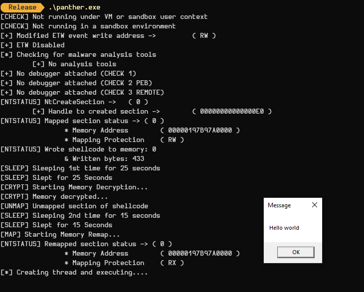

# panther

Panther is a C based initial access payload which attempts to bypass AV and EDR. The success rate of bypassing these security defense tool will vary depending on implementation, detection capabilities and similar functionality.

Panther includes features such as:

- Anti-analysis protection
- Anti-VM protection
- Sandbox environment checks
- Direct Syscalls (Hell's Gate)
- Memory hiding
- Shellcode encryption (RC4) 

If you want to add more arrays for a string you can use the following script:
- [format_to_char_array.py](https://gist.github.com/Kr0ff/a7441e296c15efdf737ed9d36ae71497)

If a shellcode is too large that it can't fit on the stack, you can use the .RSRC section of PE to store your payload. For this purpose you need to encrypt the shellcode and save it to a file in a raw format and place it in the folder of the payload as a `.bin` format.
The `payload.bin` contains a shellcode for `MessageBox()` that will display `Hello World !`. The contents of `shellc.h` are of unencrypted and encrypted shellcode of `MessageBox`.

# Disclaimer
The author of this code is not liable for how this program is used by third-parties !